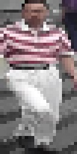
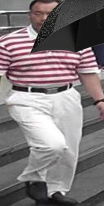
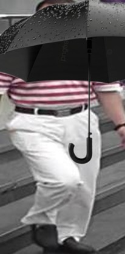
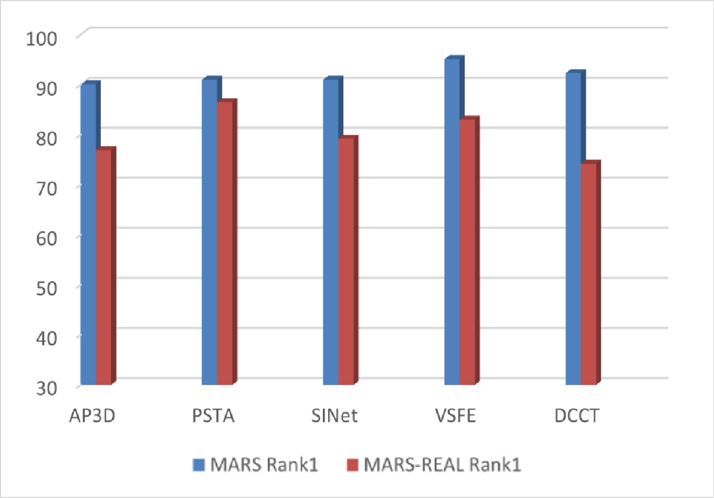
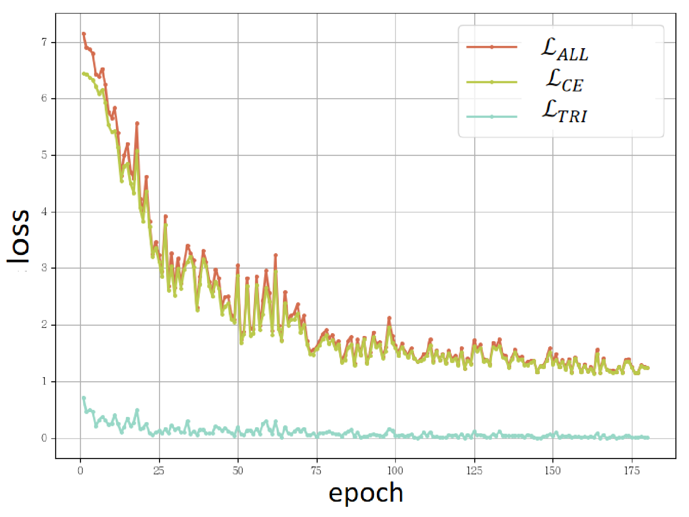
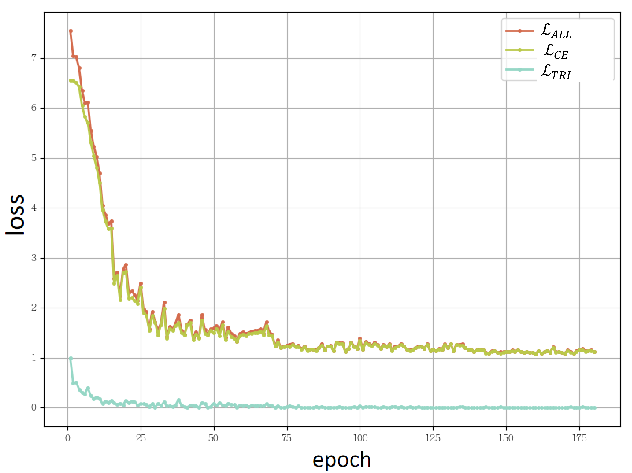
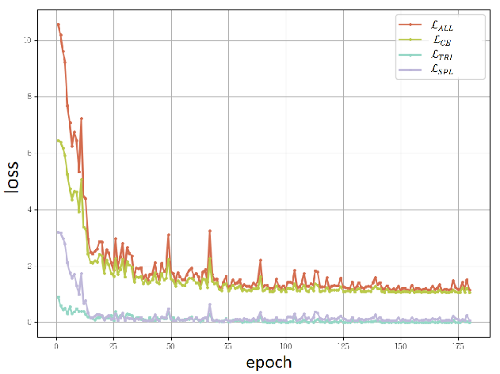
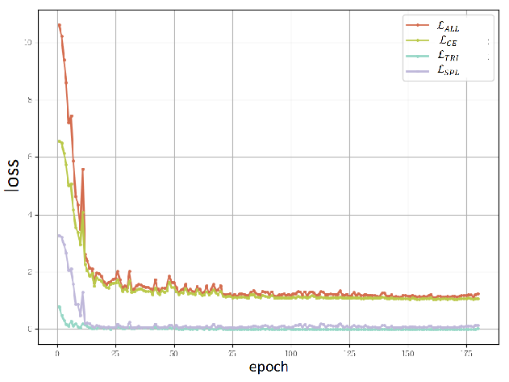

# ReID-MSP
VIDEO RE-IDENTIFICATION BASED ON MULTI-LEVEL SELF-PACED LEARNING

## 1. Analysis of Existing Datasets

Table **1** provides detailed statistics of the five most widely used video ReID datasets. For convenience, iLIDS-VID is abbreviated as iLIDS-V; DukeMTMC-VideoReID as Duke-V; and PRID-2011 as PRID. The datasets are sorted by usage frequency, based on their appearances in 45 video ReID papers over the past three years. Mark **†** indicates the presence of distractors. In iLIDS-V and PRID, each query corresponds to only one correct match, thus mAP is not reported. The main gaps between these datasets and real-world scenarios are as follows:

- **Viewpoint:** Each query in these datasets has on average fewer than 4 true cross-camera trajectories. In real-world scenarios (e.g., tracking a fleeing suspect), retrieval often involves dozens of cameras. Different camera locations and angles lead to significant viewpoint variations, increasing intra-class variation and reducing ReID performance. Therefore, real scenarios present greater challenges in viewpoint diversity.
- **Illumination:** MARS, Duke-V, and PRID are captured under relatively stable lighting conditions. iLIDS-V and LS-VID contain minor illumination variations. In practice, time of day and weather can introduce extreme lighting conditions (e.g., dusk or rainy weather), reducing video quality and increasing intra-class variation.
- **Clarity:** Existing datasets filter low-quality frames to ensure uniform clarity. In real scenarios, variations in camera distance, device type, and resolution produce uneven image clarity, increasing intra-class variation.
- **Occlusion:** Most datasets are captured in idealized scenarios with limited occlusion. In real scenes, occlusion by vehicles, umbrellas, and other pedestrians is common, challenging model robustness.
- **Frame Misalignment:** iLIDS-V, Duke-V, and PRID use manual annotations for precise bounding boxes. Other datasets also avoid complex backgrounds to minimize detection errors. In real scenarios, frequent occlusion and complex backgrounds reduce detection accuracy, leading to frame misalignment, lower-quality trajectory features, and increased ReID difficulty.

**Table 1. Video Re-Identification Datasets**

| Attribute                                  |      MARS | iLIDS-V |    Duke-V |          LS-VID |              PRID |
| ------------------------------------------ | --------: | ------: | --------: | --------------: | ----------------: |
| Release Year                               |      2016 |    2014 |      2018 |            2019 |              2011 |
| Usage Frequency                            |      100% |     62% |       40% |             38% |               35% |
| Number of IDs                              |     1,261 |     300 |    1,812† |           3,772 |               178 |
| Number of Trajectories                     |   20,751† |     600 |     4,832 |          14,943 |               354 |
| Number of Frames                           | 1,067,516 |  42,460 |   815,420 |       2,982,685 |            40,033 |
| Number of Trajectories per ID              |      13.9 |       2 |       3.4 |               4 |                 2 |
| Number of Cross-Camera Trajectories per ID |       3.7 |       2 |         1 |             < 4 |                 2 |
| Number of Frames per Trajectory            |        58 |      73 |       168 |             200 |               100 |
| Evaluation Metrics                         | CMC & mAP |     CMC | CMC & mAP |       CMC & mAP |               CMC |
| Number of Cameras                          |         6 |       2 |         8 |              15 |                 2 |
| Lighting Variation                         |        No |     Yes |        No |             Yes |                No |
| Collection Scenario                        |    Campus | Airport |    Campus | Indoor + Campus | Specific Sidewalk |
| Annotation Method                          |       DPM |  Manual |    Manual |    Faster R-CNN |            Manual |

## 2. Effects of Dataset Realization

Table **2** summarizes the parameter ranges and example effects of five types of data augmentation used for dataset realization, at two levels. All parameters are randomly sampled within the specified ranges to ensure that different trajectories receive varying types and degrees of transformation.

**Table 2. Parameter Ranges and Effects of Dataset Realization Transformations**

<table>
  <thead>
    <tr>
      <th>Transformation</th>
      <th>Related Parameter</th>
      <th>Level 1</th>
      <th>Effect</th>
      <th>Level 2</th>
      <th>Effect</th>
    </tr>
  </thead>
  <tbody>
    <!-- Viewpoint -->
    <tr>
      <td rowspan="2">Viewpoint</td>
      <td>Type</td>
      <td>Flip, Rotate</td>
      <!-- Effect should span 2 rows -->
      <td rowspan="2">
        

          
          
        

      </td>
      <td>Flip, Rotate</td>
      <!-- Effect should span 2 rows -->
      <td rowspan="2">
        

          
          
        

      </td>
    </tr>
    <tr>
      <td>Rotation Angle</td>
      <td>(-20, 20)</td>
      <td>(-40, 40)</td>
    </tr>
    <!-- Illumination -->
    <tr>
      <td>Illumination</td>
      <td>Brightness Factor</td>
      <td>(0.6, 1.4)</td>
      <!-- Effect should span 2 rows -->
      <td>
        

          
          
        

      </td>
      <td>(0.2, 1.8)</td>
      <!-- Effect should span 2 rows -->
      <td>
        

          
          
        

      </td>
    </tr>
    <!-- Clarity -->
    <tr>
      <td rowspan="3">Clarity</td>
      <td>Type</td>
      <td>Low-Res, Blur</td>
      <!-- Effect should span 3 rows -->
      <td rowspan="3">
        

          
          
        

      </td>
      <td>Low-Res, Blur</td>
      <!-- Effect should span 3 rows -->
      <td rowspan="3">
        

          
          
        

      </td>
    </tr>
    <tr>
      <td>Resolution Factor</td>
      <td>0.4</td>
      <td>0.2</td>
    </tr>
    <tr>
      <td>Motion Blur Kernel</td>
      <td>15</td>
      <td>30</td>
    </tr>
    <!-- Occlusion -->
    <tr>
      <td rowspan="2">Occlusion</td>
      <td>Occluder Type</td>
      <td>10</td>
      <!-- Effect should span 2 rows -->
      <td rowspan="2">
        

          
          
        

      </td>
      <td>10</td>
      <!-- Effect should span 2 rows -->
      <td rowspan="2">
        

          
          
        

      </td>
    </tr>
    <tr>
      <td>Occlusion Level</td>
      <td>(0.3, 0.4)</td>
      <td>(0.5, 0.6)</td>
    </tr>
    <!-- Frame Misalignment -->
    <tr>
      <td>Frame Misalignment</td>
      <td>Misalignment Degree</td>
      <td>(0, 0.5)</td>
      <!-- Effect should span 2 rows -->
      <td rowspan="2">
        

          
          
        

      </td>
      <td>(0, 1)</td>
      <!-- Effect should span 2 rows -->
      <td rowspan="2">
        

          
          
        

      </td>
    </tr>
    <tr>
    </tr>
  </tbody>
</table>

## 3. Rank-1 Performance of Existing Methods in Realistic Scenarios

As shown in Fig. **1**, the decrease in Rank-1 performance is smaller than that in mAP. Rank-1 measures the accuracy of retrieving the single most relevant match, reflecting performance on the simplest samples. In contrast, mAP considers all correct matches in the gallery, so any error reduces the score. In realistic datasets, simple samples remain, but some samples become harder, increasing the proportion of difficult samples. This requires higher model robustness. Therefore, Rank-1 drops slightly, while mAP drops significantly, indicating current models struggle with hard samples.

**Fig. 1. Rank-1 Performance of Existing Methods in Realistic Scenarios**

## 4. Trajectory Self-Paced Learning Algorithm

The trajectory self-paced algorithm is presented in Algorithm **1**.

#### Algorithm 1: Trajectory Self-Paced Learning Algorithm

**Input:** Training dataset $\mathcal{D}$, initial model parameters $\theta^{(0)}$ 
**Output:** Trained model parameters $\theta$

1. Initialize $p^{(0)} \gets 50$, $\Delta p \gets 10$, $T \gets 20$
2. **for** $t = 1$ **to** MAX_EPOCH **do:**
   - Compute cross-entropy loss $\{l_i\}_{i=1}^N$ for each sample
   - Compute dynamic threshold $\tau$ according to Eq.~(\ref{eq:dynamic_threshold}), such that $\tau$ is the $p^{(t)}$ percentile of $\{l_i\}_{i=1}^N$
   - Compute sample weights $\{v_i\}_{i=1}^N$ using Eq.~(\ref{vi}) and $\tau$
   - Compute self-paced learning loss $\mathcal{L}_{\text{SPL}}$ according to Eq.~(\ref{LSPL})
   - Update model parameters
   - **if** $t \mod T = 0$ **then:**
     - Update percentile according to Eq.~(\ref{eq.p})
3. **Return** $\theta$

## 5. Experimental Settings

Experiments are conducted on four NVIDIA GeForce RTX 3080 Ti GPUs, each with 12GB memory. In training, each batch contains 8 identities (IDs), with 4 trajectories per ID (32 trajectories in total). Each trajectory is randomly sampled from a random start point with 8 frames, augmented with random horizontal flip and random erasing. During testing, all available trajectories are used, and each trajectory is sampled starting from the first frame with 8 frames. All frames are resized to 256×128.

The PSTA model is used as the baseline. Adam optimizer with WarmupMultiStepLR is employed. The initial learning rate is 0.00035, warmed up linearly for the first 10 epochs. The learning rate decays to 0.3× at epochs 70, 140, and 210. Maximum training is 300 epochs.

For trajectory self-paced learning, the initial percentile controlling the loss threshold is 50, increased by 10 every 20 epochs until all samples participate after 100 epochs. This setting ensures the model first learns easy features before gradually handling harder samples.

## 6. Training Loss Analysis

Fig. **2** shows the loss decay curves. The baseline loss combines cross-entropy and triplet loss, while the multi-level self-paced model additionally includes a self-paced loss. The results show that the multi-level self-paced model converges faster and exhibits smoother loss curves.

<table style="border-collapse:collapse; width:100%;">
  <tbody>
    <tr>
      <td style="width:50%; padding:12px; vertical-align:top; text-align:center;">
        
        
Baseline Model (MARS-REAL)

      </td>
      <td style="width:50%; padding:12px; vertical-align:top; text-align:center;">
        
        
Baseline Model (Duke-REAL)

      </td>
    </tr>
    <tr>
      <td style="width:50%; padding:12px; vertical-align:top; text-align:center;">
        
        
Multi-level Self-Paced Learning (MARS-REAL)

      </td>
      <td style="width:50%; padding:12px; vertical-align:top; text-align:center;">
        
        
Multi-level Self-Paced Learning (Duke-REAL)

      </td>
    </tr>
  </tbody>
</table>

<strong>Figure 2:</strong> Loss decay curves of baseline and multi-level self-paced learning models

